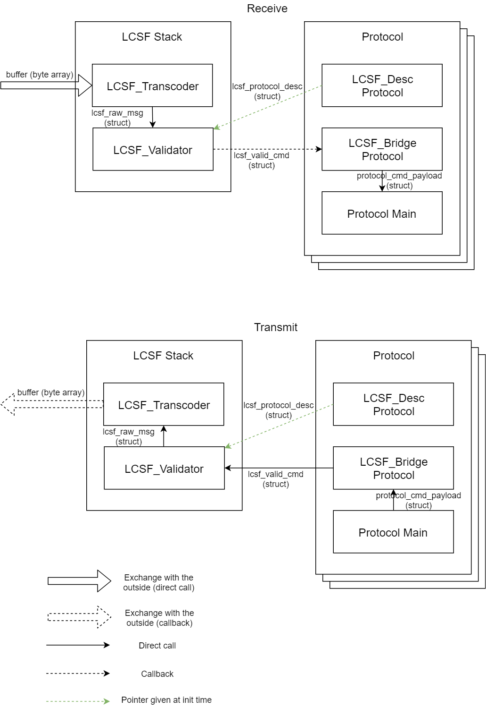

## Presentation

LCSF C Stack is a C implementation of the LCSF (Light Command Set Format), designed for, but not limited to, small embedded systems (bare metal friendly, static memory allocation, small footprint <3kB data, 1kB ram).

This adds a software layer to easily encode/decode custom command sets based on LCSF to your project.

## About LCSF

LCSF is a specification to easily create and deploy custom command sets.

For more information on the project, check the official LCSF documentation [here](https://jean-roland.github.io/LCSF_Doc/).

## How to use
First, include all the source files in your project. You can find example set-up code in `custom_main.c`.

Modules must be initialized once in your application before you can use them. Using before initializing might result in a bad address fault.

Then, to interface with your project:
* Create a custom protocol either by modifying the example protocol files or by using the [LCSF Generator](https://github.com/jean-roland/LCSF_Generator) (recommended).
* Call the function `LCSF_TranscoderReceive` when you received a buffer containing an lcsf message, this will call the adequate function in your `<protocol>_Main.c`.
* Call the function `LCSF_Bridge_Encode` to encode a buffer with an lcsf_message that you can then send. Example call can be found in your `<protocol>_Main.c`.

You can change some stack parameters (protocol array size, lifo size) in `include/LCSF_config.h`.

## How the stack works

The stack itself is composed of two main files:
* `LCSF_Transcoder.c`: This module is in charge of decoding and encoding message respecting the LCSF format.
* `LCSF_Validator.c`: This module is in charge of verifying if messages correspond to a known command set protocol.

They are accompanied by a support file:
* `Lifo.c`: A module that creates memory pool that can be used as lifo memory.

Then the actual protocols are fed into the stack at initialization time.

The following diagram helps understanding how it works:



## Representations

The default LCSF representation used by the transcoder is the standard one. You can switch to the smaller representation by uncommenting the `#define LCSF_SMALL` symbol declaration found in `LCSF_Config.h`

## Protocol files

Each protocol used by the LCSF C stack is composed of 5 files:
* `LCSF_protocol_Desc.c`: This file contains the tables describing the protocol commands and attributes.
* `LCSF_Bridge_protocol.c/.h`: This files contain the LCSF abstraction layer.
* `<protocol>_Main.c/.h`: This files contain the application code associated with the protocol.

## Note on recursivity

Since LCSF is based on nested structures, the stack use recursive functions.

Recursivity is generally frowned upon in embedded applications, which is why the stack is made to limit the issue:
* The number of calls is directly linked to the number of sub-attribute layers in a protocol, that means the user has direct control.
* The stack is linear in its recursivity (one call will only lead to a maximum of one other call).
* The stack is limited by the depth of its lifo when making new calls, it is guaranteed to not infinitely loop.

## Build, tests & docs

If you want to build the project as is, you need to install [CMake](https://cmake.org/) 3.14 or above, and a buildsystem ([Ninja](https://ninja-build.org/) is recommended).

Build commands, if using Ninja, at project root:
 ```
 cmake -B build/ -G Ninja -DCMAKE_BUILD_TYPE="Release"
 cmake --build build/
 ```

To run the test suite, you need to install [Cpputest](http://cpputest.github.io/). If you have library errors, you might need to modify the root `CMakeLists.txt` to specify the Cpputest location.
Then, use the following commands still at project root:

`cmake --build build/ --target run_tests`

To generate the doc, you need to install [Doxygen](https://www.doxygen.nl/), then run at project root:

`doxygen doc/cfg/Doxyfile`

You can access the documentation with the adequate system link found in `doc/`.

## Resource usage

This section aims at providing information regarding the LCSF_C_Stack resource consumption on an embedded target.

The lcsf stack was tested on a EFM32 leopard gecko dev board with a si446x rf transceiver. Resource usage will differ depending on your target, toolchain and application.

For more information, check the full resource usage report [here](./Resource_usage.md).

The rough values are:
* Program memory: `~6kB`
* Heap memory: `<1kB`
* Stack memory: `~250 bytes`
